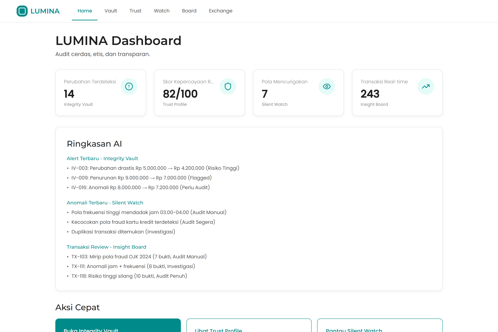

# LUMINA — Ethical AI Auditing Platform

A dashboard concept for AI-assisted auditing that keeps the automation itself accountable: smart, ethical, and transparent. LUMINA surfaces anomalies, scores trust, and watches for suspicious patterns — and for every flag it shows the evidence and a plain-language explanation of *why*.

**Live demo → [lumina-ai-auditing.vercel.app](https://lumina-ai-auditing.vercel.app)**



## Overview

Automated auditing is only useful if people can trust and understand it. LUMINA is built around that idea: instead of a black box that just says "suspicious," every finding carries its evidence, a severity level, and a human-readable rationale. The result is an interface where an auditor can see what the system noticed, why it mattered, and what to do next.

## Modules

- **Insight Board** — a real-time overview of transactions. Each flagged item lists how much evidence was found and an explanation of the decision.
- **Integrity Vault** — tracks value changes (original → new) with timestamps and risk levels, catching drastic or anomalous edits.
- **Silent Watch** — monitors for suspicious behavioural patterns, each with a severity rating and time window.
- **Trust Profile** — computes a trust score per entity so reputation is visible at a glance.
- **Secure Exchange** — a blockchain-hash-verified transaction flow that rejects tampered or high-risk transactions.

## Tech stack

- React + Vite + TypeScript
- Tailwind CSS + shadcn/ui
- React Router
- Responsive, mobile-through-desktop layout with a clean, dashboard-first design system

## Run locally

```bash
git clone https://github.com/GianneAngely/LUMINA.git
cd LUMINA
npm install
npm run dev
```

Then open the printed local URL.

## Note

Concept prototype. All transactions, scores, and alerts are mock data used to demonstrate the interface and the "explainable audit" idea; there is no live backend or real model behind it.
